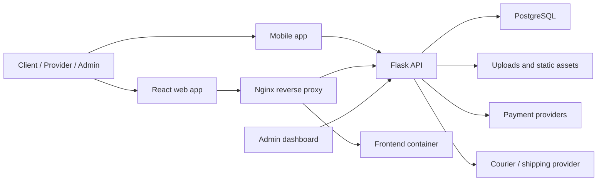

# AG8TE System Overview

Captured: 2026-07-13

Confidentiality: Non-confidential; based on repository structure and public deployment shape.

## Notes

- Frontend routes include shop, login, transport booking, checkout, booking history, user dashboards, and admin dashboard.
- Backend exposes `/api/shop`, `/api/admin`, `/api/requests`, `/api/payments`, `/api/dashboard`, and related service routes.
- Production deployment uses Docker Compose with app, frontend, PostgreSQL, and Nginx services on the `ag8te.com` domain.
